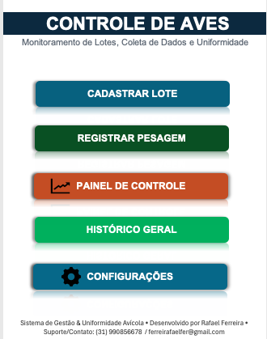
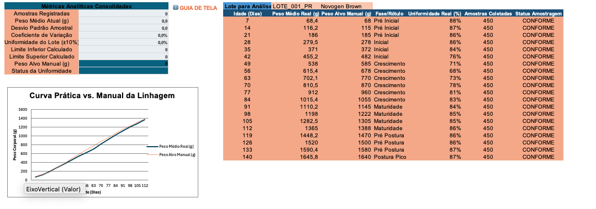
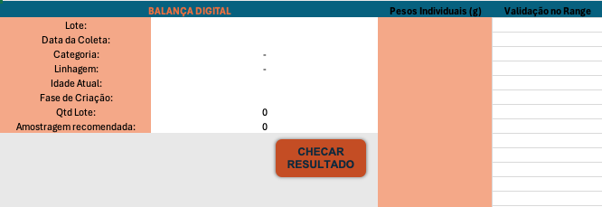

# 🐔 Automação Zootécnica: Monitoramento de Uniformidade e Crescimento de Aves

Ferramenta desenvolvida em **Excel e VBA** para automatizar a pesagem semanal, checagem de regras de amostragem no galpão, cálculo de uniformidade e comparação com as curvas dos manuais de linhagens.

---

## 🎯 Por que esta planilha foi criada?

Durante a minha experiência técnica na produção comercial de postura, acompanhei semanalmente o desenvolvimento e o crescimento de pintainhas, realizando a pesagem e a avaliação da uniformidade dos lotes ao longo de toda a fase de cria e recria.

Na rotina de campo, identifiquei a ausência de uma ferramenta prática que integrasse três necessidades fundamentais:

* **Validação e cálculo imediato:** Reduzir o tempo gasto no processamento manual das pesagens e no cálculo dos índices de uniformidade ($\pm 10\%$).
* **Comparação direta com o padrão genético:** Cruzar o peso real das aves com as curvas oficiais dos manuais de linhagens comerciais de forma automática.
* **Rastreabilidade e série temporal:** Manter um histórico acumulado das pesagens anteriores, permitindo avaliar não apenas o lote ativo, mas a evolução temporal do galpão entre ciclos.

Esta aplicação foi desenvolvida exatamente para suprir esse gargalo operacional, transformando anotações isoladas num banco de dados estruturado para suporte técnico e tomada de decisão rápida.
---

## 📸 Demonstração da Planilha

## 📸 Demonstração da Planilha

### Menu Principal & Navegação

  

### Painel de Controle (Resultados e Curvas)

  

### Coleta e Validação de Pesagens

---

## ⚙️ O que a ferramenta faz

1. **Cadastro do Lote:**
   - Registra data de alojamento, categoria (corte ou postura) e linhagem. O sistema vincula automaticamente as metas de peso para cada idade.
2. **Validação de Amostragem na Coleta:**
   - Exige um mínimo de 100 aves ou 1% do galpão para validar a pesagem.
   - Impede o salvamento se faltar data ou ID do lote.
3. **Cálculos Zootécnicos Automáticos:**
   - **Peso Médio e Desvio Padrão:** base do comportamento do galpão.
   - **Uniformidade do Lote (%):** proporção de aves situadas na faixa de tolerância de ±10% em torno da média:

$$\text{Uniformidade (\%)} = \left( \frac{\text{Aves com peso entre } 0{,}9 \times \bar{P} \text{ e } 1{,}1 \times \bar{P}}{\text{Total de aves pesadas}} \right) \times 100$$

4. **Classificação do Lote:**
   - Status imediato por cores e faixas: Excelente ($\ge 85\%$), Boa ($\ge 80\%$), Regular ($\ge 70\%$) ou Crítica ($< 70\%$).
5. **Navegação em Tela Única:**
   - As telas funcionam por botões. O VBA oculta as abas secundárias (`xlSheetVeryHidden`) para proteger os dados das linhagens contra alterações acidentais.
6. **Histórico Acumulado:**
   - As pesagens salvas alimentam uma base contínua com formatação padronizada, pronta para auditorias ou conexão com Power BI.

---

## 📂 Organização dos Scripts VBA (Pasta `/src`)

Para quem quiser ver o código-fonte sem precisar baixar a planilha, as macros estão separadas em:

* **[`src/GestaoLotesEPesagens.bas`](./src/GestaoLotesEPesagens.bas):** cadastro de lotes e validação das pesagens semanais.
* **[`src/NavegacaoSistema.bas`](./src/NavegacaoSistema.bas):** rotina de navegação entre as telas e controle de visibilidade das abas.
* **[`src/ConfiguracoesEAdmin.bas`](./src/ConfiguracoesEAdmin.bas):** gerador da interface de parâmetros e rotina de limpeza de dados com senha de segurança.

---

## 🚀 Como testar a planilha

1. Baixe o arquivo [`app/Automacao_Uniformidade_Aves.xlsm`](./app/Automacao_Uniformidade_Aves.xlsm).
2. Abra no Excel e clique em **Habilitar Conteúdo** (Habilitar Macros).
3. Na tela de início, clique em **NOVO LOTE** para preencher os dados do lote.
4. Em **NOVA COLETA**, digite os pesos de balança na coluna E.
5. Clique em **CHECAR RESULTADOS E SALVAR** para enviar os dados ao histórico e abrir o **PAINEL DE CONTROLE**.
